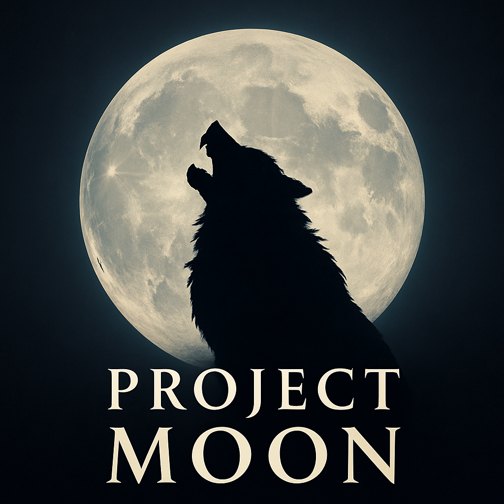

  

*Project Moon* – A narrative action-adventure prototype built in Unreal Engine 5.

# 🌕 Project Moon
A narrative-driven adventure-RPG prototype built in Unreal Engine 5.

## 🧩 Concept
Set in a cursed medieval land ravaged by a lycanthropic plague, the player takes on the role of a ranger apprentice, part of a secret order sworn to uncover and eradicate the source of the curse.

## 🎮 Design Goals
- Create a modular level layout that supports stealth, combat, and exploration.
- Build a detective gameplay loop (identify clues, trigger interactions, uncover mysteries).
- Integrate narrative beats into quest structure and world design.
- Emphasize immersion through immersive gameplay and environmental storytelling.

## ⚙️ Systems Implemented
- Blueprint-based detection system
- Interactive clue/popup system
- Basic AI behavior tree setup
- Quest progression prototype
- Dialogue system
- Combat system

## 📷 Screenshots / Video Demo
*(Add .gifs or YouTube link or images here)*

## 🛠 Tech Stack
- Unreal Engine 5
- Blueprint scripting
- Git version control

## 🧠 What I Learned
- Balancing narrative with systemic gameplay
- Designing for player guidance without hand-holding
- Structuring prototype systems that can scale
